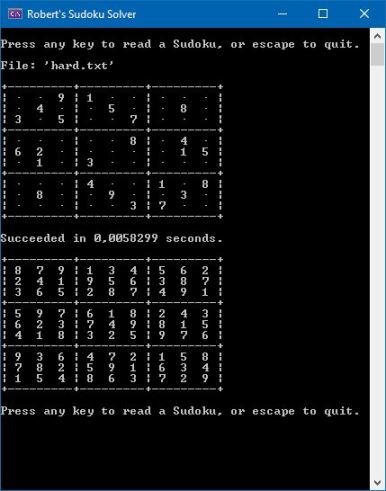

## Sudoku

||||
|:---:|:---:|:---:|
|WPF Empty|WPF Read|WPF Solved|
||||
||Console||

#### Description
Working desktop applications for test and demo purpose solving Sudoku-puzzles by means of a backtracking algorithm.

Implementation in C# the following varieties.
*  WPF. 
   * Interactive screen.
   * Animates the intermediate states during the solving process.
*  Console. 
   *  Bare bones. 
   *  A lot faster.

#### Aspects
* WPF.
* C# + XAML.
* MVVM based on the MVVM Light Toolkit.
* Asynchronicity.
* Basic styling.
* DataTable for animation.
